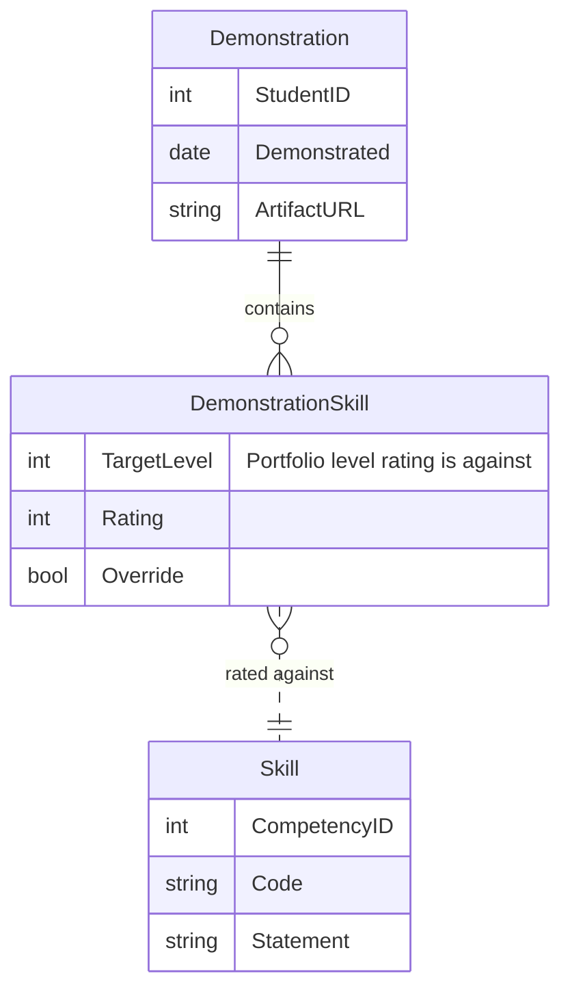
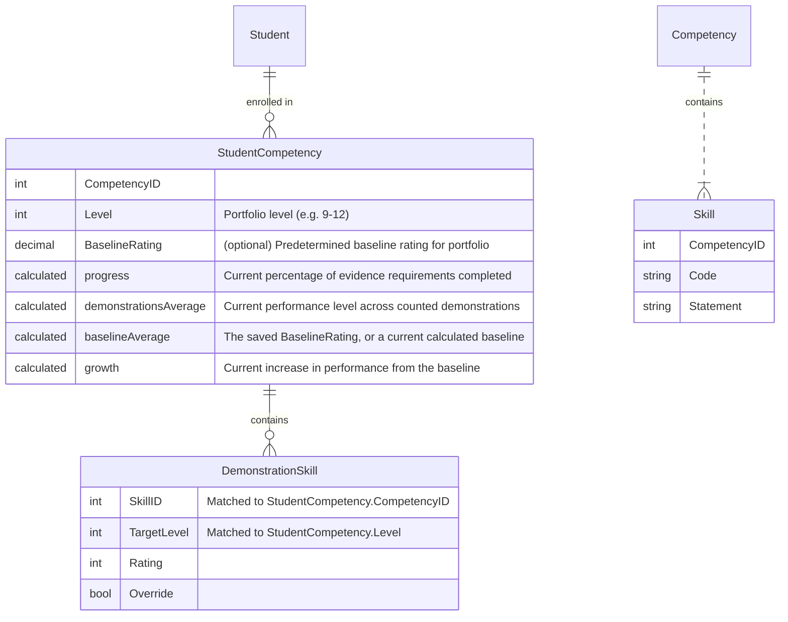

# CBL Data Model

## Ratings

Ratings are input as children of `Demonstration` records. Each `Demonstration` can have any number of associated ratings, each associated with exactly one `Skill`. Accordingly, each rating is stored within a `DemonstrationSkill` record.

## Portfolios

A portfolio exists at the intersection of a `Student`, a `Competency`, and a `Level`, and is backed in database by a `StudentCompetency` record. A student is *enrolled* in a given competency at a given porfolio level by creating one of these records. They can either be created manually by school administrators, or automatically by policy upon the completion of a previous portfolio within the same competency. A `StudentCompetency` record may also capture a predetermined baseline performance level for purposes of calculating growth.

Progress, performance level, and growth for a give portfolio are calculated based on all the ratings within all a student's demonstrations that target the portfolio level and a skill within the competency.

## Progress and performance level

The following table shows an example set of ratings that might be available for a given `StudentCompetency` record, where the `ER1`...`ER4` columns illustrate that these skills all have an evidence requirement of 4 ratings:

| Skill     | ER1 | ER2 | ER3 | ER4 |
| --------- | ---:| ---:| ---:| ---:|
| `ELA.1.1` |   9 |  11 |     |     |
| `ELA.1.2` |   9 |  11 |     |     |
| `ELA.1.3` |   9 |  11 |     |     |

In this simple scenario, performance level is `9` and progress is `50%`.
