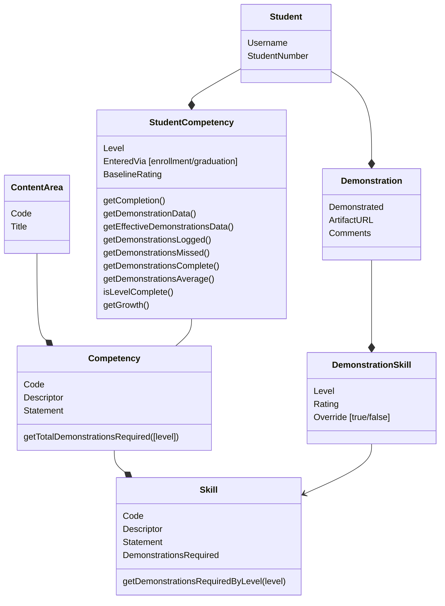

# Data

```mermaid
classDiagram

ContentArea --* Competency
Competency --* Skill

Student --* StudentCompetency
StudentCompetency -- Competency

Student --* Demonstration
Demonstration --* DemonstrationSkill
DemonstrationSkill --> Skill

ContentArea : Code
ContentArea : Title

Competency : Code
Competency : Descriptor
Competency : Statement
Competency : getTotalDemonstrationsRequired([level])

Skill : Code
Skill : Descriptor
Skill : Statement
Skill : DemonstrationsRequired
Skill : getDemonstrationsRequiredByLevel(level)

Student : Username
Student : StudentNumber

StudentCompetency : Level
StudentCompetency : EnteredVia [enrollment/graduation]
StudentCompetency : BaselineRating
StudentCompetency : getCompletion()
StudentCompetency : getDemonstrationData()
StudentCompetency : getEffectiveDemonstrationsData()
StudentCompetency : getDemonstrationsLogged()
StudentCompetency : getDemonstrationsMissed()
StudentCompetency : getDemonstrationsComplete()
StudentCompetency : getDemonstrationsAverage()
StudentCompetency : isLevelComplete()
StudentCompetency : getGrowth()

Demonstration : Demonstrated
Demonstration : ArtifactURL
Demonstration : Comments

DemonstrationSkill : Level
DemonstrationSkill : Rating
DemonstrationSkill : Override [true/false]

```