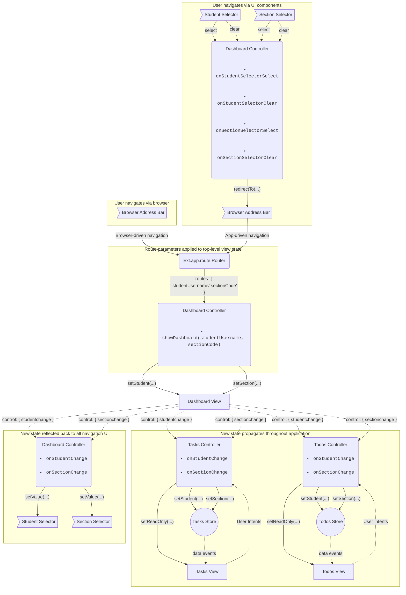

# Student Task Management

## Current Tasks

- Initially presented as a single stream of all tasks for all sections
- Filtering available by section, due dates, and task status
- Task details can be opened by clicking the task in the Current Tasks list
- Once a task is completed, the task is removed from the Current Tasks list and moved to the Past Tasks (Portfolio) section

## To Do List

- Student created list of items to do
- Due dates optionally set by students
- When completed, To Do items move to the Completed Items seciton
- Clearing completed items occurs one at a time or thourgh the Clear All button

## Past Tasks

- Summary of all completed and rated tasks for a given section
- Specifies the number of skills associated with a given task and how many were rated on and below the current level for that skill

## Submitting a Task

- After opening a task, students can view all relvant information as well as add links and attachments
- When ready, students submit the task and any associated documents to a teacher for rating

## State flow

