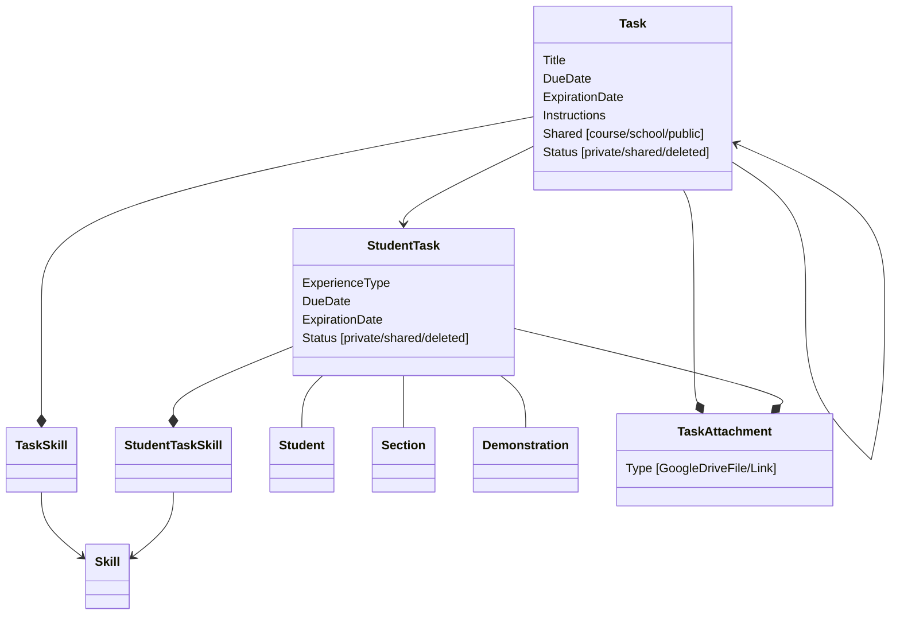

# Tasks

```mermaid
classDiagram

Task --> Task
Task --* TaskSkill
TaskSkill --> Skill
Task --> StudentTask
StudentTask --* StudentTaskSkill
StudentTask -- Student
StudentTask -- Section
StudentTask -- Demonstration
StudentTaskSkill --> Skill
Task --* TaskAttachment
StudentTask --* TaskAttachment

Task : Title
Task : DueDate
Task : ExpirationDate
Task : Instructions
Task : Shared [course/school/public]
Task : Status [private/shared/deleted]

StudentTask : ExperienceType
StudentTask : DueDate
StudentTask : ExpirationDate
StudentTask : Status [private/shared/deleted]

TaskAttachment : Type [GoogleDriveFile/Link]

```