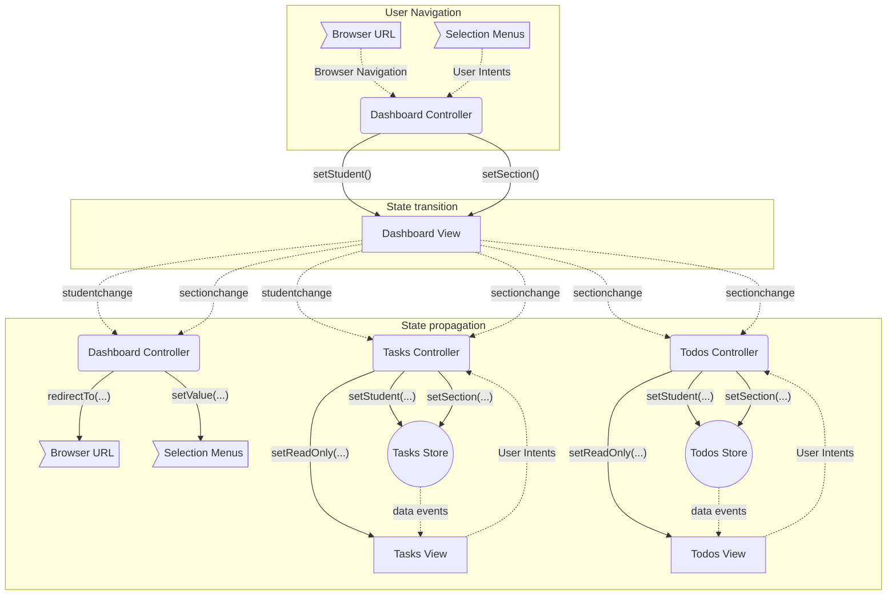

# SlateTasksStudent

## Getting started with development

- `sencha app build development`
- `sencha app refresh`

## Application Lifecycles

### State flow

## TODO

- [ ] Review and optimized task detail methods and views
- [ ] Refactor task/todo models and eliminate use of associations in favor of top-level fields so that views can monitor store events for changes and controllers never call `view.refresh()` manually after changes