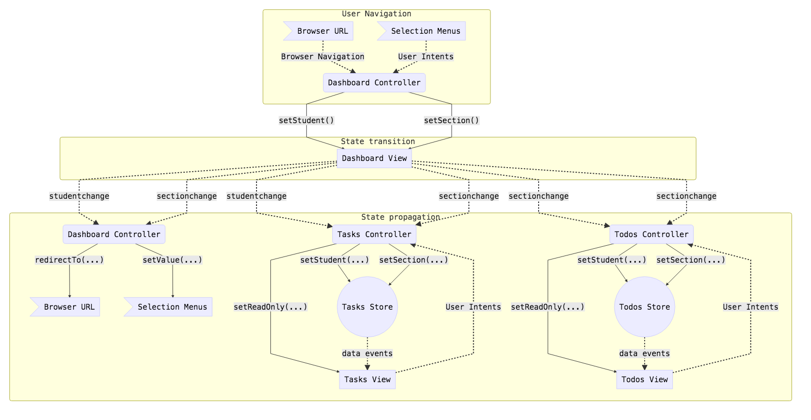

# SlateTasksStudent

## Getting started with development

- `sencha app build development`
- `sencha app refresh`

## Application Lifecycles

### State flow

### Best Practices

- Use `select`/`clear` events instead of `change` to monitor navigation combos for route updates -- they only fire in response to direct user input
- Ensure blank components aren't appended to paths

## TODO

- [ ] Review and optimized task detail methods and views
- [ ] Refactor task/todo models and eliminate use of associations in favor of top-level fields so that views can monitor store events for changes and controllers never call `view.refresh()` manually after changes